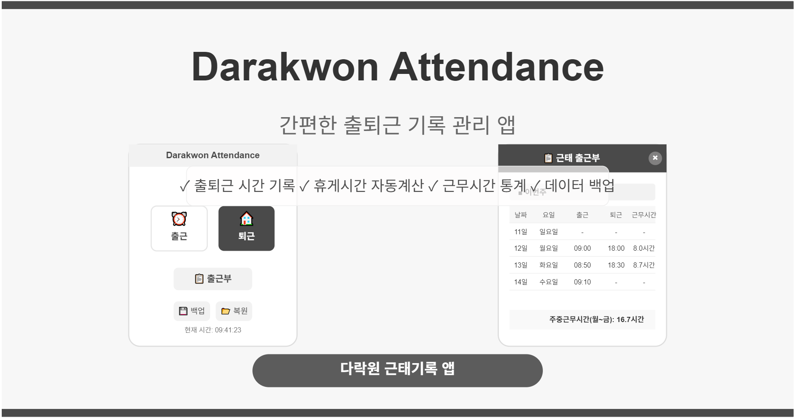

# Darakwon Attendance (다락원 근태기록 앱)

다락원 임직원을 위한 간편한 근태 기록 관리 웹 애플리케이션입니다. 출퇴근 시간을 기록하고 근무 시간을 자동으로 계산해 주며, PWA(Progressive Web App)로 구현되어 모바일 홈 화면에 설치하여 앱처럼 사용할 수 있습니다.

## 주요 기능

- **출퇴근 시간 기록**: 간편한 버튼 클릭으로 출퇴근 시간 기록
- **근무 시간 자동 계산**: 
  - 점심 시간(11:30~12:00) 자동 제외
  - 11시간 초과 근무 시 저녁 시간 1시간 자동 제외
- **주간 근무 시간 통계**: 주중(월~금) 근무 시간 합계 자동 계산
- **데이터 백업/복원**: 출퇴근 기록 JSON 파일로 백업 및 복원
- **오프라인 지원**: PWA 기술을 활용한 오프라인 사용 지원

## 기술 스택

- **프론트엔드**: HTML, CSS, JavaScript (순수 JavaScript, 프레임워크 없음)
- **데이터 저장**: IndexedDB(1순위), localStorage(2순위), 메모리 저장소(3순위)
- **PWA 기능**: Service Worker, Web Manifest
- **반응형 디자인**: 모바일 최적화 UI/UX

## 사용 방법

1. **앱 설치**:
   - 모바일에서: 브라우저 메뉴에서 '홈 화면에 추가' 선택
   - 데스크톱에서: 브라우저 주소창 오른쪽의 설치 아이콘 클릭

2. **출퇴근 기록**:
   - 출근 시: '출근' 버튼 클릭 (하루에 한 번만 기록됨)
   - 퇴근 시: '퇴근' 버튼 클릭 (마지막 기록으로 업데이트됨)

3. **기록 확인**:
   - '출근부' 버튼 클릭으로 이번 주/지난 주 기록 확인
   - 주중(월~금) 근무 시간 합계 확인

4. **데이터 관리**:
   - 백업: '백업' 버튼 클릭하여 JSON 파일로 다운로드
   - 복원: '복원' 버튼 클릭 후 백업 파일 선택

## 개발 목적

이 앱은 다락원 임직원들의 출퇴근 시간을 간편하게 기록하고 근무 시간을 효율적으로 관리하기 위해 개발되었습니다. 모바일 환경에 최적화되어 있으며, 오프라인에서도 사용 가능하도록 설계되었습니다.

## 구현 사항

- **영구 데이터 저장**: IndexedDB를 활용한 안정적인 데이터 저장
- **다중 저장소 백업 메커니즘**: 기기/브라우저 환경에 따른 최적 저장소 선택
- **PWA 설치 지원**: 홈 화면에 추가하여 네이티브 앱처럼 사용 가능
- **오프라인 캐싱**: Service Worker를 통한 오프라인 기능 지원
- **모바일 최적화 UI**: 터치 기반 인터랙션 및 모바일 친화적 디자인

## 라이센스

이 프로젝트는 비공개 소프트웨어로, 다락원의 내부 사용 목적으로 제작되었습니다.

© 2025 Darakwon Publishing Co., Ltd.
